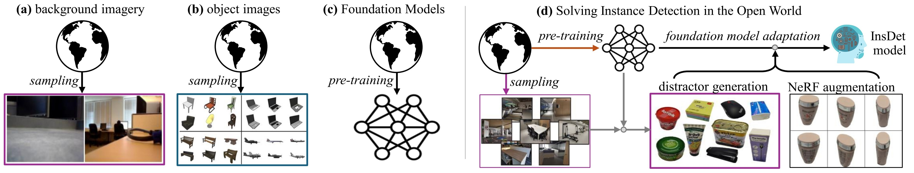

<div align="center">
<h1>Solving Instance Detection from an Open-World Perspective</h1>

[**Qianqian Shen**](https://shenqq377.github.io/)<sup>1</sup> · [**Yunhan Zhao**](https://yunhan-zhao.github.io/)<sup>2</sup> ·  [**Nahyun Kwon**](https://nahyunkwon.github.io/)<sup>3</sup> · [**Jeeeun Kim**](https://github.com/qubick)<sup>3</sup> · [**Yanan Li**](https://yananlix1.github.io/)<sup>4</sup> · [**Shu Kong**](https://aimerykong.github.io/)<sup>5</sup><sup>,</sup><sup>6</sup></span>
                
<sup>1</sup>Zhejiang University&emsp;<sup>2</sup>UC Irvine&emsp;<sup>3</sup>Texas A&M University&emsp;<sup>4</sup>Zhejiang Lab&emsp;<sup>5</sup>University of Macau&emsp;<sup>6</sup>Institute of Collaborative

<a href="https://arxiv.org/pdf/2503.00359"></a>
<a href='https://shenqq377.github.io/IDOW/'></a>
<a href="https://eval.ai/web/challenges/challenge-page/2478/overview/"></a>
<!-- <a href='https://huggingface.co/datasets/depth-anything/DA-2K'></a> -->
</div>



Movitated by the InsDet's `open-world nature`, we exploit diverse open data and foundation models to solve **InsDet in the open world (IDOW)**. To better adapt FM for instance-level feature matching, we introduce `distractor sampling` to sample patches of random background images as universal negative data to all object instances, and `novel-view synthesis`generate more visual references not only training but for testing. Our IDOW outperforms prior works by >10 AP in both conventional and novel instance detection settings.

## Code
The project is built on [detectron2](https://github.com/facebookresearch/detectron2), [SAM](https://github.com/facebookresearch/segment-anything), [GroundingDINO](https://github.com/IDEA-Research/GroundingDINO), and [DINOv2](https://github.com/facebookresearch/dinov2).<br>

The Jupyter notebooks files demonstrate our IDOW on [HR-InsDet](https://github.com/insdet/instance-detection) dataset and [RoboTools](https://github.com/Jaraxxus-Me/VoxDet) dataset.

## Citation
If you find our project useful, please consider citing:
```bibtex
@inproceedings{shen2025solving,
  title={Solving Instance Detection from an Open-World Perspective},
  author={Shen, Qianqian and Zhao, Yunhan and Kwon, Nahyun and Kim, Jeeeun and Li, Yanan and Kong, Shu},
  booktitle={Proceedings of the IEEE/CVF Conference on Computer Vision and Pattern Recognition (CVPR)},
  year={2025}
```
